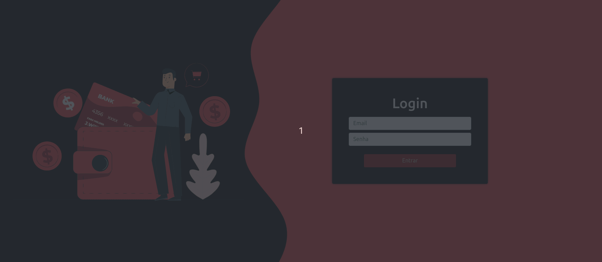

## How I created and deployed this app

1. npx create-react-app international-wallet
2. npm install gh-pages --save-dev
3. npm install react-router-dom --save-dev
4. npm install reactstrap react react-dom
5. `package.json`:
	- "homepage": "https://Vincenzofdg.github.io/International-Wallet",
	- "predeploy": "npm run build",
	- "deploy": "gh-pages -d build",
6. On index.js importe `BrowserRouter` and use as `<BrowserRouter basename={process.env.PUBLIC_URL}><BrowserRouter/>`

## Knowledges:

 - Redux;
 - Redux Thunk.

## Preview:

